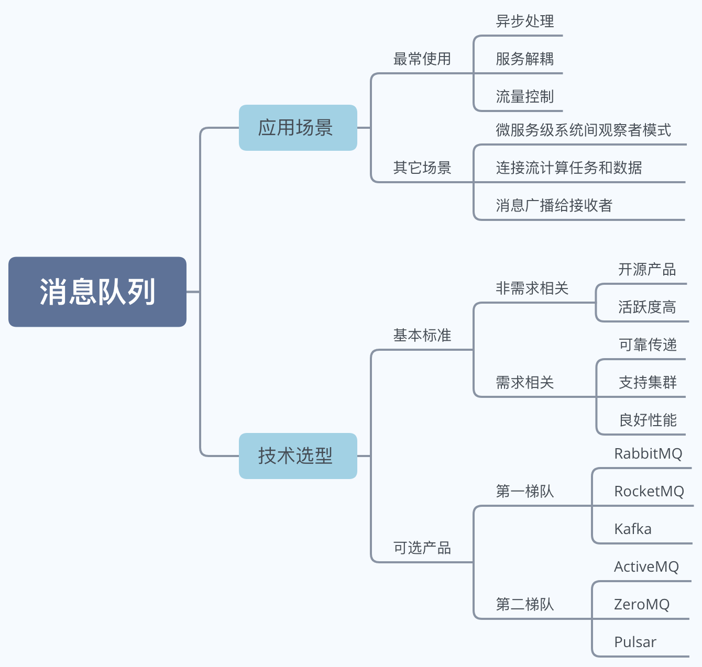
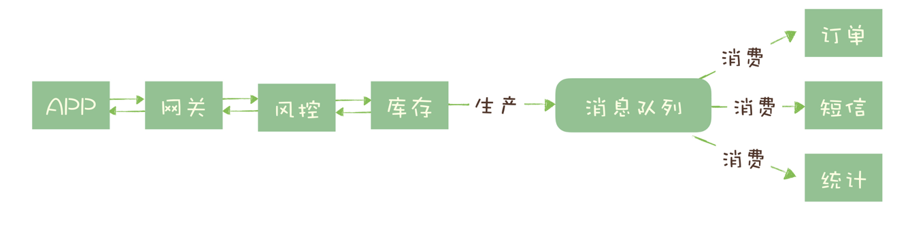
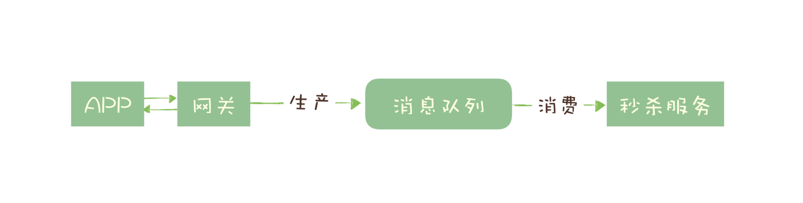
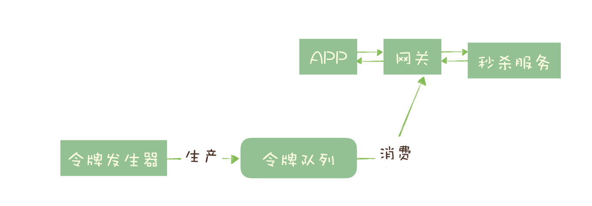

## 消息队列应用场景与技术选型

**内容大纲**

 

### 一、应用场景

该部分讲的是消息队列适合解决哪些问题，最常见的有以下几种：

#### 1.异步处理

以秒杀系统为例说明，一个秒杀系统解决的核心问题是，**如何利用有限服务器资源，尽可能多的处理短时间内的海量请求**，一个没有优化的秒杀请求处理步骤有风险控制、库存锁定、生成订单、短信通知、更新统计数据。

只有风险控制、库存锁定这两步决定秒杀成功，服务器端完成这两步可确定秒杀结果，直接给客户返回响应，请求数据放到消息队列，剩余步骤通过消息队列异步进行操作，处理秒杀请求从5个步骤降为2个步骤，充分利用有限服务器资源处理海量秒杀请求。

该场景中可以看出服务异步处理好处：
- 可以更快返回响应

- 减少等待、自然实现步骤间并发，提升系统总体性能

#### 2.流量控制

流量控制是为了避免过多请求压垮系统，需要健壮的架构来保护后端服务。

##### 思路1 消息队列隔离

**一种设计思路是使用消息队列隔离网关和后端服务，达到流量控制和保护后端服务的目的**。

以秒杀系统为例，秒杀开始短时间大量服务到达网关，先堆积到消息队列，后端按照自己的能力从消息队列中消费请求进行处理。

优点：能根据下游的处理能力自动调节流量，达到“削峰填谷”的作用。

缺点：

- 增加了系统调用链环节，导致总体的响应时延变长
- 上下游系统都要将同步调用改为异步消息，增加了系统的复杂度

##### 思路2 令牌队列

**用消息队列实现一个令牌桶，更简单地进行流量控制。**

令牌桶控制流量的原理是：单位时间内只发放固定数量的令牌到令牌桶中，规定服务在处理请求之前必须先从令牌桶中拿出一个令牌，如果令牌桶中没有令牌，则拒绝请求。这样就保证单位时间内，能处理的请求不超过发放令牌的数量，起到了流量控制的作用。

结合秒杀场景，令牌发生器按照预估的处理能力，匀速生产令牌并放入令牌队列（如果队列满了则丢弃令牌），网关在收到请求时去令牌队列消费一个令牌，获取到令牌则继续调用后端秒杀服务，否则返回失败。

优点：实现的方式也很简单，不需要破坏原有的调用链。

#### 3.服务解偶

消息队列的另外一个作用，就是实现系统应用之间的解耦。

电商系统中，电商下游系统需要实时获取订单数据：

方式1，通过接口获取实时数据，这种方式使下游系统和订单服务耦合性极高，接口变更会导致订单系统做更改。

方式2，订单服务在订单变化时发送消息到特定主题，下游订阅主题获取实时订单数据。无论增加、减少下游系统或是下游系统需求如何变化，订单服务都无需做任何更改，实现了订单服务与下游服务的解耦。

#### **4.其它场景**

- 连接流计算任务和数据

- 将消息广播给接收者

- 作为发布订阅系统实现一个微服务系统间的观察者模式

  在观察者模式中，通过消息队列去传递消息。但是更本质的区别是在观察者模式下，观察者必须知道被监听者的存在。即观察者必须调用被监听者的接口。而发布/订阅模式下，两者是解耦的，互相都不用知道对方的存在。

引入消息队列可以解决以上应用场景中描述的问题，同时也应该注意到消息队列的局限性：

- 引入消息队列带来的延迟问题
- 增加系统复杂性
- 可能产生数据不一致

所以应该根据目标业务的特点和自身条件选择是否引入消息队列。

### 二、技术选型

#### 基本标准

每一种消息队列都有自由的优势和劣势，要根据现有系统的情况进行合适选择，在选择的时候有一个最低标准。

##### 非需求相关

这两个标准不是和消息队列本身满足的业务需求有直接关系的，但却不容忽视。

- 开源

  首先应该选择开源产品，这样的好处是在使用消息队列中遇到影响业务的Bug，可以有机会通过修改源码迅速解决或者规避，而不是等待产品开发者在之后版本发布。

- 活跃度高

  这个产品必须是近年来比较流行并且有一定社区活跃度的产品，好处是遇到Bug的概率低，即使有Bug也可能其他人已经遇到并且修复，遇到类似问题容易在网上找到解决方案。

  利用好处就是活跃度高的产品与周边生态有良好的集成和兼容，比如Kafka 和 Flink 就有比较好的兼容性，Flink 内置了 Kafka 的 Data Source，使用 Kafka 就很容易作为 Flink 的数据源开发流计算应用，如果是小众消息队列还需要自己去开发一个Flink的Data Source。

##### 需求相关

一款合格的消息队列产品还需满足以下特性，否则将不能满足基本的业务需求。

- 消息可靠传，确保不求消息
- 支持集群，避免单节点宕机后服务不可用
- 良好的性能，确保可以满足大多数场景对性能的需求

#### 可选产品

根据产品被使用的流行度，划分为两个梯队，优先考虑第一梯队中的产品。

##### 第一梯队

1.RabbitMQ

老牌消息队列，用小众语言Erlang实现，支持AMPQ(一种消息队列标准)协议，客户端支持多种编程语言（大概是所有消息队列支持最多的），轻量级，方便部署和使用。

特色功能是支持灵活的路由配置，它在生产者（Producer）和队列（Queue）之间增加了一个 Exchange 模块，可以理解为交换机。根据配置的路由规则将生产者发出的消息分发到不同的队列中。路由的规则也非常灵活，可以自己来实现路由规则，如果需要这一功能则可以进行选择。

缺点：

- 对消息堆积支持不好，消息积压，性能会下降
- 性能相对较差，几万到十几万条消息，如果应用对性能有较高要求不推荐使用
- 使用Erlang语言，不容易做扩张和二次开发

2.RocketMq

RocketMQ 是阿里巴巴在 2012 年开源的消息队列产品，后来捐赠给 Apache 软件基金会，经历过阿里双十一的考验，在性能、可靠性、稳定性方面都值得信赖。

RocketMQ 的性能比 RabbitMQ 要高一个数量级，每秒钟大概能处理几十万条消息。使用Java语言实现，容易扩展和二次开发，对在线业务响应时延做了相应优化，**大多数情况可实现毫秒级响应，应用场景在意时延响应，则应该选择RabbitMQ**。

缺点：国产消息队列，与国外同类产品相比，在国际上流行度不高，与周边生态的系统集成和兼容会不太好。

3.Kafka

Kafka 最早是由 LinkedIn 开发，目前也是 Apache 的顶级项目。Kafka 最初的设计目的是用于处理海量的日志。

在早期的版本中，为了获得极致的性能，在设计方面做了很多的牺牲，比如不保证消息的可靠性，可能会丢失消息，也不支持集群，这些牺牲对于处理海量日志这个特定的场景都是可以接受的。

当下的 Kafka 已经发展为一个非常成熟的消息队列产品，数据可靠性、稳定性等方面都可以满足绝大多数场景的需求， 与周边生态系统的兼容性非常好，尤其在大数据和流计算领域，几乎所有的相关开源软件系统都会优先支持 Kafka，使用 Scala 和 Java 语言开发，设计上大量使用了批量和异步的思想，这种设计使得 Kafka 能做到超高的性能，大约每秒钟可以处理几十万条消息。

缺点：异步批量的设计带来的问题是，它的同步收发消息的响应时延比较高，因为当客户端发送一条消息的时候，Kafka 并不会立即发送出去，而是要等一会儿攒一批再发送，所以不适合在线业务场景。

##### 第二梯队

这些产品之所以没那么流行，或多或少都有着比较明显的短板，不推荐使用。

1.ActiveMQ

ActiveMQ 是最老牌的开源消息队列，是十年前唯一可供选择的开源消息队列，目前已进入老年期，社区不活跃。功能和性能方面，Acti与现代的消息队列存在明显的差距。

2.ZeroMQ

严格来说 ZeroMQ 并不能称之为一个消息队列，而是一个基于消息队列的多线程网络库，实现高性能网络通信，将消息队列的功能集成到你的系统进程中，可以考虑使用 ZeroMQ。

3.Pulsar

Pulsar 是一个新兴的开源消息队列产品，最早是由 Yahoo 开发，目前处于成长期，流行度和成熟度相对没有那么高。与其他消息队列最大的不同是，Pulsar 采用存储和计算分离的设计，这可能是一个引领消息队列未来发展的一个方向。
