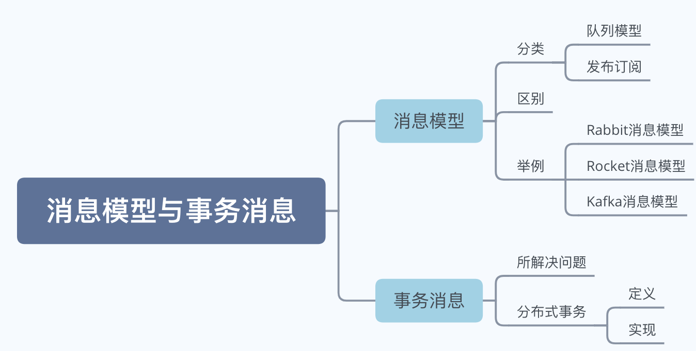
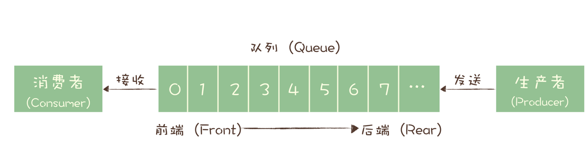
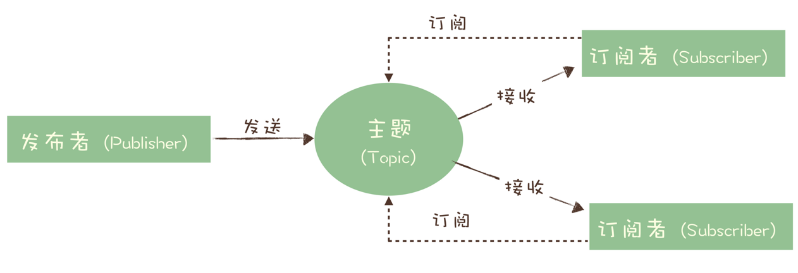
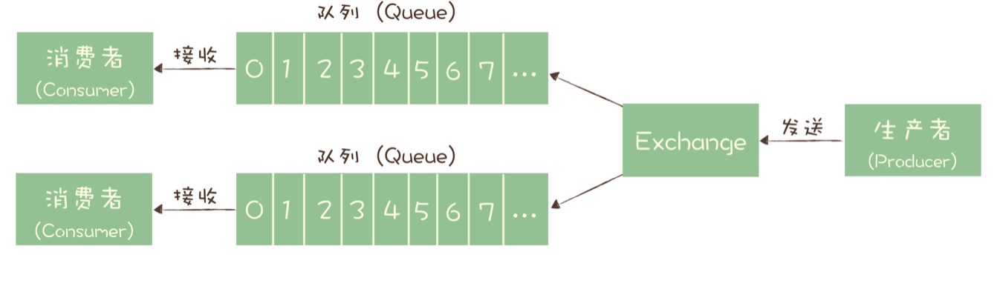
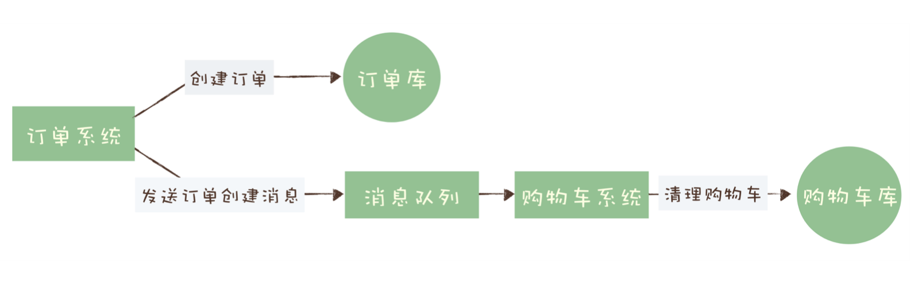
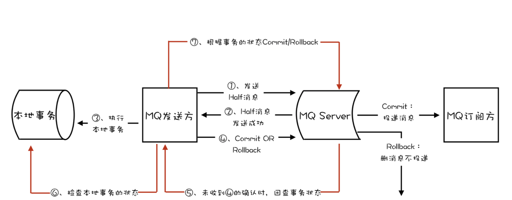

# 消息模型与消息事务

**内容大纲**

## 一、消息模型

消息队列模型有队列和发布订阅两种，**这里的模型是业务层的模型**，而非实现层，不同消息队列实现有差异。

### 1.队列模型

最初的消息队列采用队列这种先进先出的数据结构设计，即队列模型。

- 生产者（Producer）：发送消息是入队操作
- 消费者（Consumer）：收到消息对应出队操作
- 服务端：存放消息的容器称为队列

#### 局限性

不能将一份全量数据发给多个消费者，多个消费者消费队列中的消息时，消费者之间存在竞争关系，一条消息只能被一个消费者消费。

解决办法：

1、生产者发送多份消息到消费者对应的队列，缺点是多份复制浪费资源，生产者需要知道消费者，违背解耦。

2、发布-订阅模型

### 2.发布订阅

为了解决队列模型的局限性，演化出**发布 - 订阅模型（Publish-Subscribe Pattern）**。

- 发布者（Publisher）：消息的发送方
- 订阅者（Subscriber）：消息的接收方
- 主题（Topic）：服务端存放消息的容器
- 订阅：订阅者在接收消息之前需要先订阅主题

### 3.区别

**它们最大的区别其实就是，一份消息数据能不能被多个消费者消费**。

有些消息队列同时支持这两种消息模型，比如 ActiveMQ。对比一下这两种模型，生产者就是发布者，消费者就是订阅者，队列就是主题，并没有本质的区别。在这种发布 - 订阅模型中，如果只有一个订阅者，那它和队列模型就基本是一样的了。

### 4.举例

#### RabbitMQ 的消息模型

 RabbitMQ是少数依然坚持使用队列模型的产品之一，Exchange 位于生产者和队列之间，生产者并不关心将消息发送给哪个队列，而是将消息发送给 Exchange，由 Exchange 上配置的策略来决定将消息投递到哪些队列中。

解决多个消费者问题：同一份消息如果需要被多个消费者来消费，需要配置 Exchange 将消息发送到多个队列，每个队列中都存放一份完整的消息数据，可以为一个消费者提供消费服务。

#### RocketMQ 的消息模型

**每个主题包含多个队列，通过多个队列来实现多实例并行生产和消费。**RocketMQ 只在队列上保证消息的有序性，主题层面是无法保证消息的严格顺序的。

- 消费组（Consumer Group）

  每个消费组有一份完整消息，不同消费组之间消费不受影响，同一消费组内消费者存在竞争关系，同一消息被消费组中一个消费者消费则不能被其他消费者消费。

- 消费位置（Consumer Offset）

  在 Topic 的消费过程中，由于消息需要被不同的组进行消费，所以消费完的消息并不会立即被删除，这就需要  为每个消费组在每个队列上维护一个消费位置（Consumer Offset），这个位置之前的消息都被消费过，之后的消息都没有被消费过。

#### Kafka 的消息模型

消息模型和 RocketMQ 完全一样，唯一的区别是在 Kafka 中队列这个概念的名称不一样，Kafka 中对应的名称是“分区（Partition）”，含义和功能是没有任何区别的。

## 二、 事务消息

### 1.所解决问题

**消息队列中的“事务”，主要解决的是消息生产者和消息消费者的数据一致性问题。**

#### 实例

用户在电商 APP 上购物时，先把商品加到购物车里，然后几件商品一起下单，最后支付，完成购物流程，就可以等待收货了。这个过程中有一个需要用到消息队列的步骤，订单系统创建订单后，发消息给购物车系统，将已下单的商品从购物车中删除。因为从购物车删除已下单商品这个步骤，并不是用户下单支付这个主要流程中必需的步骤，使用消息队列来异步清理购物车是更加合理的设计。

出现数据不一致有：

- 创建了订单，没有清理购物车
- 订单没创建成功，购物车里面的商品却被清掉了

**需要解决的问题**：在上述任意步骤都有可能失败的情况下，还要保证订单库和购物车库这两个库的数据一致性。

购物车系统失败的处理比较简单，只要成功执行购物车清理后再提交消费确认即可，如果失败，由于没有提交消费确认，消息队列会自动重试。

订单系统中，要通过**事务**保证创建订单和发送消息这两个步骤要么都操作成功，要么都操作失败，不允许一个成功而另一个失败的情况出现。

### 2.分布式事务

#### 1.定义

一个严格的事务实现应该具备原子性、一致性、隔离性、持久性ACID特性。

- 原子性

  一个事务操作不可分割，要么成功，要么失败。

- 一致性

  数据在事务执行完成这个时间点之前，读到的一定是更新前的数据，之后读到的一定是更新后的数据，不应该存在一个时刻，让用户读到更新过程中的数据。

- 隔离性

  是指一个事务的执行不能被其他事务干扰。即一个事务内部的操作及使用的数据对正在进行的其他事务是隔离的。

- 持久性

  是指一个事务一旦完成提交，后续的其他操作和故障都不会对事务的结果产生任何影响。

**分布式事务就是要在分布式系统中的实现事务**，实现严格的分布式事务是困难的任务。目前说的分布式事务，更多情况下，**是在分布式系统中事务的不完整实现**。

**事务消息**作为一种分布式事务实现方式，适用的场景主要是需要异步更新数据。

#### 2.实现

事务消息需要消息队列提供相应的功能才能实现，Kafka 和 RocketMQ 都提供了事务相关功能。

订单和购物车这个例子，我们一起来看下如何用消息队列来实现分布式事务。

订单系统在消息队列上开启一个事务。然后订单系统给消息服务器发送一个“半消息”。

- 半消息

  不是说消息内容不完整，它包含的内容就是完整的消息内容，半消息和普通消息的唯一区别是，在事务提交之前，对于消费者来说，这个消息是不可见的。

半消息发送成功后，订单系统就可以执行本地事务了，在订单库中创建一条订单记录，并提交订单库的数据库事务。然后根据本地事务的执行结果决定提交或者回滚事务消息：

- 创建成功，那就提交事务消息，购物车系统就可以消费到这条消息继续后续的流程。
- 创建失败，那就回滚事务消息，购物车系统就不会收到这条消息。

这样就基本实现了“要么都成功，要么都失败”的一致性要求。

提交事务消息时失败解决方案

- Kafka

  直接抛出异常，让用户自行处理。我们可以在业务代码中反复重试提交，直到提交成功，或者删除之前创建的订单进行补偿。

- RocketMQ

  增加了事务反查的机制来解决事务消息提交失败的问题，在提交或者回滚事务消息时发生网络异常，RocketMQ 的 Broker 没有收到提交或者回滚的请求，Broker 会定期去 Producer 上反查这个事务对应的本地事务的状态，然后根据反查结果决定提交或者回滚这个事务。

  为了支撑这个事务反查机制，我们的业务代码需要实现一个反查本地事务状态的接口，告知 RocketMQ 本地事务是成功还是失败。

  不依赖消息的发送方，即某个实例节点上的任何数据。发送事务消息的服务节点宕机了，通过节点来执行反查，确保事务完整性。

